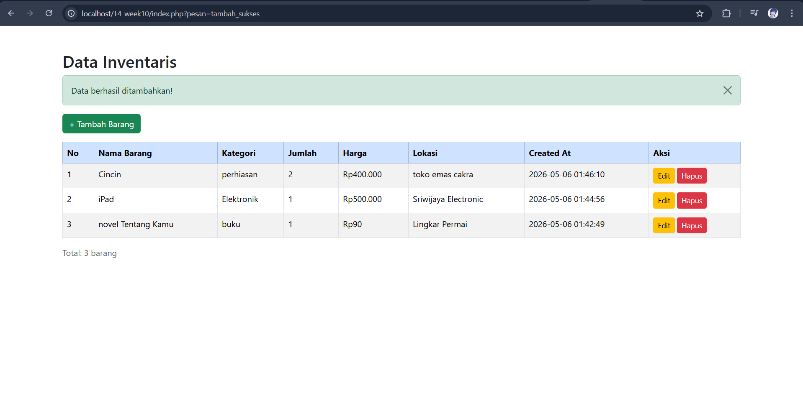
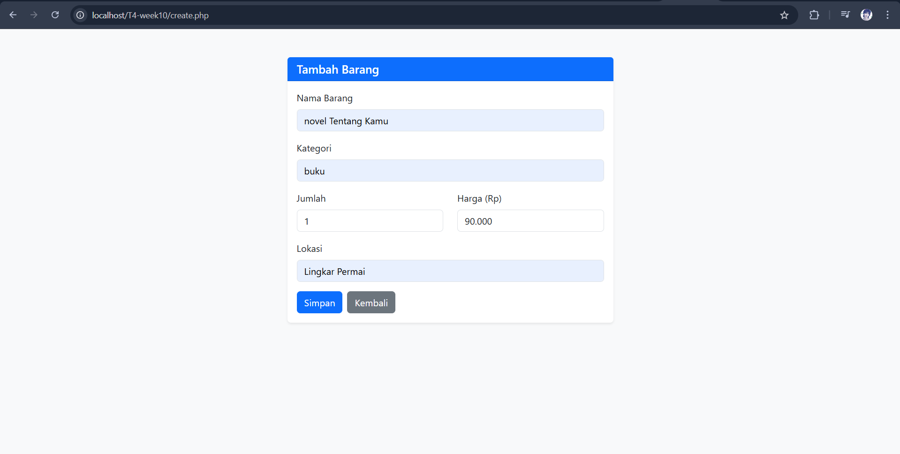
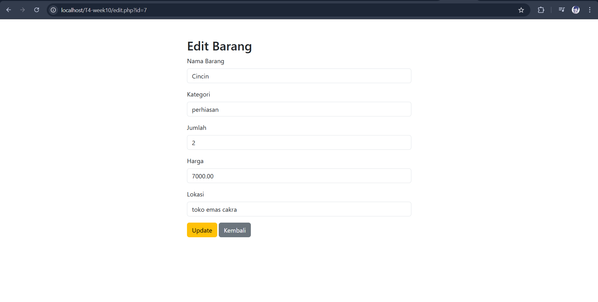
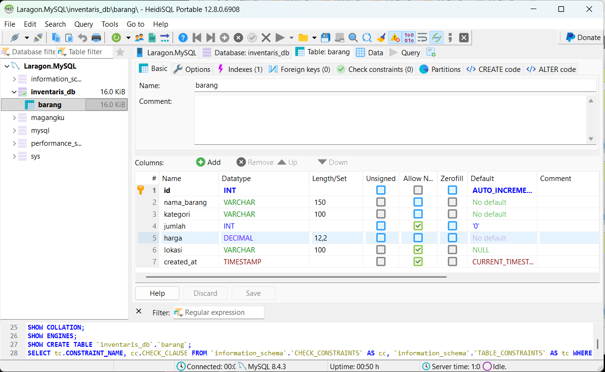

# T4-week10 - Aplikasi CRUD PHP MySQL

Nama  : Annisa Makarima Ahlaq
NIM   : F1D02410106
Kelas : Pemrograman Web kelas C

## Deskripsi
Aplikasi CRUD (Create, Read, Update, Delete) menggunakan PHP, MySQL, dan Bootstrap.

- Database  : inventaris_db (NIM Genap)
- Tabel     : barang (NIM Genap)

## Cara Menjalankan
1. Import file .sql ke laragon/database/heidisql
2. Letakkan folder project di www/ (Laragon)
3. Buka browser ke http://localhost/T4-week10/

## Screenshot

### Daftar Data

### Tambah Data

### Edit Data

### Struktur Database (phpMyAdmin)
